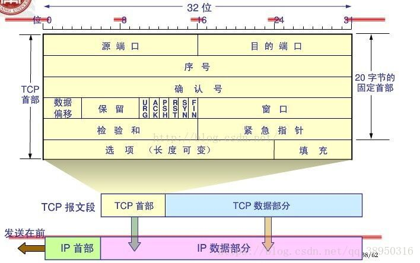

<!-- TOC -->

- [socket 编程](#socket-编程)
- [tcp编程](#tcp编程)
    - [tcp报文格式](#tcp报文格式)
    - [tcp三次握手四次挥手](#tcp三次握手四次挥手)
- [reference](#reference)

<!-- /TOC -->

# socket 编程

  主要是转载和记录。
    
# tcp编程

   传输控制协议（TCP，Transmission Control Protocol）是一种面向连接的、可靠的、基于字节流的传输层通信协议，由IETF的 [RFC793](https://tools.ietf.org/html/rfc793) 定义
   
 - 面向连接
   
   为了保证可靠性，双方在通信前要进行3次握手来建立连接，之后才通信，故广播和多播不会承载在tcp上。

 - 可靠性

   由于TCP处于多跳通信的IP层之上，而IP层并不提供可靠的传输，因此在TCP层看来就有四种常见传输错误问题，分别是比特错误(packet bit errors)、包乱序(packet reordering)、包重复(packet duplication)、丢包(packet erasure或称为packet drops)，TCP要提供可靠的传输，就需要有额外的机制处理这几种错误。

   因此个人理解可靠性体现在三个方面，首先TCP通过超时重传和快速重传两个常见手段来保证数据包的正确传输，也就是说接收端在没有收到数据包或者收到错误的数据包的时候会触发发送端的数据包重传(处理比特错误和丢包)。其次TCP接收端会缓存接收到的乱序到达数据，重排序后在向应用层提供有序的数据(处理包乱序)。最后TCP发送端会维持一个发送"窗口"动态的调整发送速率以适用接收端缓存限制和网络拥塞情况，避免了网络拥塞或者接收端缓存满而大量丢包的问题(降低丢包率)。因此可靠性需要TCP协议具有超时与重传管理、窗口管理、流量控制、拥塞控制等功能。

 - 字节流

   应用层发送的数据会在TCP的发送端缓存起来，统一分片(例如一个应用层的数据包分成两个TCP包)或者打包(例如两个或者多个应用层的数据包打包成一个TCP数据包)发送，到接收端的时候接收端也是直接按照字节流将数据传递给应用层。作为对比，同样是传输层的协议，UDP并不会对应用层的数据包进行打包和分片的操作，一般一个应用层的数据包就对应一个UDP包。这个也是伴随TCP窗口管理、拥塞控制等。

## tcp报文格式

   
    
     0 1 2 3 4 5 6 7 8 0 1 2 3 4 5 6 7 8 0 1 2 3 4 5 6 7 8 0 1 2 3 4 5 6 7 8
    +-+-+-+-+-+-+-+-+-|-+-+-+-+-+-+-+-+-|-+-+-+-+-+-+-+-+-|-+-+-+-+-+-+-+-+-+
    |            Source Port            |          Destination Port         |
    +-+-+-+-+-+-+-+-+-|-+-+-+-+-+-+-+-+-|-+-+-+-+-+-+-+-+-|-+-+-+-+-+-+-+-+-+
    |                            Sequence Number                            |
    +-+-+-+-+-+-+-+-+-|-+-+-+-+-+-+-+-+-|-+-+-+-+-+-+-+-+-|-+-+-+-+-+-+-+-+-+
    |                         Acknowledgment Number                         |
    +-+-+-+-+-+-+-+-+-|-+-+-+-+-+-+-+-+-|-+-+-+-+-+-+-+-+-|-+-+-+-+-+-+-+-+-+
    | Data  |               |U|A|P|R|S|F|                                   |
    |Offset |   Reserved    |R|C|S|S|Y|I|               Window              |
    |       |               |G|K|H|T|N|N|                                   |
    +-+-+-+-+-+-+-+-+-|-+-+-+-+-+-+-+-+-|-+-+-+-+-+-+-+-+-|-+-+-+-+-+-+-+-+-+
    |              Checksum             |           Urgent Pointer          |
    +-+-+-+-+-+-+-+-+-|-+-+-+-+-+-+-+-+-|-+-+-+-+-+-+-+-+-|-+-+-+-+-+-+-+-+-+
    |                     Options                         |     Padding     |
    +-+-+-+-+-+-+-+-+-|-+-+-+-+-+-+-+-+-|-+-+-+-+-+-+-+-+-|-+-+-+-+-+-+-+-+-+
        
 - 源端口(Source Port)和目的端口(Destination Port)
 - 序列号(Sequence Number)
         
      tcp传输可靠性的基础，每一帧发送的数据每一个字节都有一个对应的序列号，而tcp首部的序列号代表第一个字节的序列号，那么这一帧数据最后一个字节的序列号是tcp首部的序列号+数据字节长度。
    
 - 确认序列号(Acknowledgment Number)

     告诉发送端这个序号之前的数据都已经正确接收到了。该字段只有标志位中ACK为1时才有效。注意是之前，也就是填写的应是接收到的最后一个字节的序列号+1。
     
 - 数据偏移/首部长度(Data Offset/Header Length)

      4个字节，tcp首部不是固定的，除了前20字节外还有个长度可变的选项，这个代表的不是多少个byte，而是多少个word，4字节最大的16，所以tcp首部最大是64byte。

 - 预留(Reserved)
 - 标志位(Flag)

   1. URG: 为1时紧急指针有效
   2. ACK: 为1时确认序列号有效
   3. PSH: PUSH标志，为1时接收端接收到后应尽快交给应用层，而不是在缓冲区排队
   4. RST: 为1时表示重连，重置错误的连接或者拒绝非法的请求连接
   5. SYN: 同步序号，主要用于tcp三次握手连接的时候发起一个新连接
   6. FIN: Finnish标志，主要用于tcp四次挥手断开连接的时候

 - 滑动窗口(Window)

     用于接收端告诉发送端我这边接收的缓存大小，从而控制发送速率，达到流量控制，占位是16bit，所以最大是65535。
     
 - 校验和(Checksum)
 - 紧急指针(Urgent Pointer)

     用于tcp发送紧急数据，是一个正的偏移量，和序列号相加得到的数就是最后一个紧急数据的序列号。

 - 选项和填充(Options and Padding)
 
## tcp三次握手四次挥手
 - 三次握手

   
  
  1. client 发起连接，要填充正确的代表建立连接信息的tcp首部，这只需要把标志位SYN置位1，
  填写起始序列号x(一般为1)，发送之后client端进入了 SYN-SEND 状态。
  
  2. server 接收到请求后要做两个动作，一是告诉client我已经接收到你的请求，同意建立连接，
  二是要发起server到client的连接申请，tcp连接是双向的。然后server进入了 SYN-RCVD 状态。
  根据上面tcp报文的分析，对于一，要把确认序列号填写为x+1，标志ACK置位为1。
  对于二，则和上面一样，填写起始序列号y，标志SYN置位1。

  3. client 接收到后也是两个动作，一是检验数据看服务器是否接收请求，即确认序列号是否为x+1，
  二是回响应，表示接收到server的请求，此时确认序列号填y+1,标志位ACK置位1。而序列号也正常递增
  为x+1，之后client进入 ESTATLISHED 状态。

 - 四次挥手

   

  1. client 发送断开连接的申请,然后进入终止等待1状态(FIN-WAIT-1),此后不再发送应用层的数据。
  
     client断开连接报文内容应是：标志FIN=1，序列seq=u。

  2. server 接收到client的释放连接请求后，返回一个响应。然后进入了关闭等待状态(CLOSE-WAIT)。
  client收到了server的响应清楚了server已经接收到了，随后进入了终止等待2状态(FIN-WAIT-2)。此时
  client端到server端连接释放完毕。

     响应报文内容应是：标志ACK=1，确认序列ack=u+1，序列seq=v。

  3. 和3次握手不一样的是，server并没有把关闭server到client的连接链路和步骤2合并在一起，原因是server
  可能仍然有数据没有发送完，所以server在 CLOSE-WAIT 状态要完成剩余数据的发送。然后在想client发送断开
  报文。server随后进入最后确认状态(LAST-ACK),此后也不在发数据给client。

     server断开连接报文内容应是：标志FIN=1，序列seq=w。
     
     不仅如此，仍设置标志ACK=1，确认序列ack=u+1。(可能是为了让client确认是与上两个步骤是对应的？)

  4. client收到server释放连接的请求后，回响应告知server已经收到，并进入 TIME-WAIT 状态等待2MSL。
  server接收到响应后进入CLOSED状态，此时server端到client端连接释放完毕。而client端等待2MSL后也进入CLOSED状态。

     响应报文内容应是：标志ACK=1，确认序列ack=w+1。

     这里还设置序列seq=u+1(不清楚为什么)
    
 - 相关问题

  1. 为什么是3次握手，而挥手是4次

     握手连接因为server可以把client申请连接的应答报文和自己向client申请连接的报文合并为一条，而挥手不行，因为server端可能有未发送完成的数据，不能马上关闭server到client的链路。

  2. TIME_WAIT 状态是什么，为什么要等2MSL

     设置这个状态的目的是保证最后一个应答server端能够正确接收到，因为网络 的不稳定性，最后一个应答可能会丢失。Server如果没有收到ACK，将不断重复发送FIN片段。所以Client不能立即关闭，它必须确认Server接收到了该ACK。Client会在发送出ACK之后进入到TIME_WAIT状态。Client会设置一个计时器，等待2MSL的时间。如果在该时间内再次收到FIN，那么Client会重发ACK并再次等待2MSL。所谓的2MSL是两倍的MSL(Maximum Segment Lifetime)。MSL指一个片段在网络中最大的存活时间，2MSL就是一个发送和一个回复所需的最大时间。如果直到2MSL，Client都没有再次收到FIN，那么Client推断ACK已经被成功接收，则结束TCP连接。
  
# reference
 - [TCP系列01―概述及协议头格式](https://www.cnblogs.com/lshs/p/6038458.html)
 - [TCP协议及帧格式](https://blog.csdn.net/marywang56/article/details/76151064?utm_medium=distribute.pc_relevant.none-task-blog-BlogCommendFromMachineLearnPai2-5.edu_weight&depth_1-utm_source=distribute.pc_relevant.none-task-blog-BlogCommendFromMachineLearnPai2-5.edu_weight)
 - [TCP报文格式详解](https://blog.csdn.net/paincupid/article/details/79726795)
 - [详解 TCP 连接的“ 三次握手 ”与“ 四次挥手 ”](https://baijiahao.baidu.com/s?id=1654225744653405133&wfr=spider&for=pc)
 - [TCP的三次握手与四次挥手理解及面试题（很全面）](https://www.cnblogs.com/bj-mr-li/p/11106390.html)