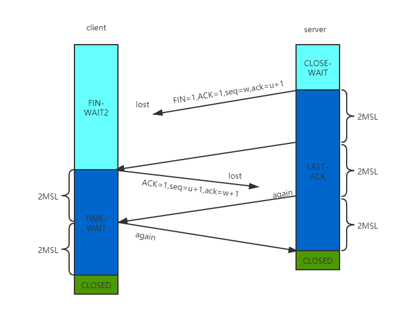
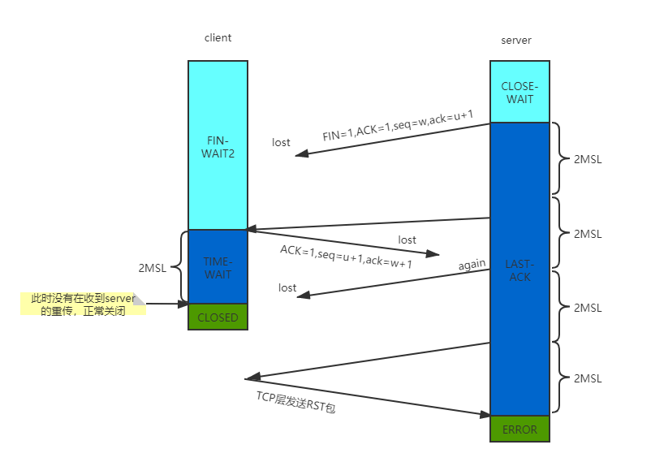

<!-- TOC -->

- [tcp socket 编程](#tcp-socket-编程)
    - [tcp socke 常用选项](#tcp-socke-常用选项)
- [reference](#reference)

<!-- /TOC -->

# tcp socket 编程

## tcp socke 常用选项
 - SO_REUSEADDR 和 SO_REUSEPORT

   顾名思义，这两个属性主要是用来重用ip和port以提高资源利用的，什么意思呢？主要和tcp的4次挥手最后的 TIME_WAIT 状态相关。

    
   
   

   如上图，tcp为了实现可靠性，有重传机制，4次挥手中先调用close()的client会进入TIME_WAIT状态，而server在第3次发起FIN关闭连接，要收到client的ACK才能正确的关闭连接。如果一段时间没有收到则进行重发。对应client端，收到FIN包后回复ACK响应，为了保证可靠性，不能立马进入关闭状态，因为ACK包可能会丢失，所以必须维持2MSL时间(MSL是报文在网络中最大的存活时间，一来一回就2MSL)，如果在这期间收到了重传的FIN包，会重新等待2MSL。所以TIME_WAIT状态强保证了最后关闭的可靠性。

   如果是图2的情况呢，这样tcp会回复一个RST包，server会认为是错误。同样的，如果没有TIME_WAIT直接CLOSED状态，那么在上一次重传就会返回RST包了。

# reference 
 - [time_wait状态产生的原因，危害，如何避免](https://blog.csdn.net/u013616945/article/details/77510925?utm_medium=distribute.pc_relevant_t0.none-task-blog-BlogCommendFromMachineLearnPai2-1.edu_weight&depth_1-utm_source=distribute.pc_relevant_t0.none-task-blog-BlogCommendFromMachineLearnPai2-1.edu_weight)